# PRODUCTO FINAL SPRINT 3
## CINEFILAND

Las redes sociales han invadido nuestra vida. Las amamos, odiamos, idolatramos y muchos no podemos vivir sin ellas.
Forman parte de nuestro día a día y nos permiten abolir las distancias; es por ello que en este Sprint  nos damos a la tarea de crear una red social.

## Requerimientos
#### Dentro de los requerimientos básicos a incluir están:
1. En lo funcional:
  *  Perfiles de usuarios
  * Un newsfeed donde puedes ver las actualizaciones de todos tus contactos
  * Un lugar donde poder escribir posts
  * Un lugar para subir fotos
  * Capacidad para poder tener amigos o para poder seguir a personas/marcas dentro de la red social
  * Ser mobile friendly

2. En lo colaborativo:

  * Trabajar en parejas
  * Tener una planificación
  * La definición del diseño
  * Diseño mobile friendly
  * Desplegar el producto en Github Pages
  (Opcional, si se desarrolla un login o se desea almacenar la información en una base de datos, usar Firebase.)
/
>Fuente LMS Laboratoria 2018

## DESCUBRIMIENTO

**ENCUESTAS**

**Gráficos**

**¿En una escala del 1-10 qué tanto le gustan las películas?**

**¿Conoce alguna red social con tema de películas?**

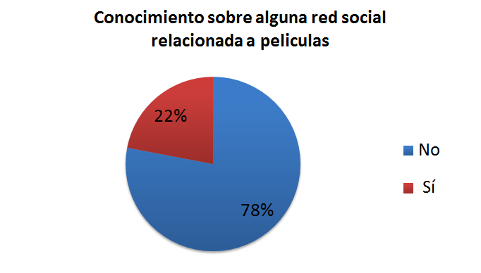

**¿Pertenece o le gustaría pertenecer a una red social sobre películas?**

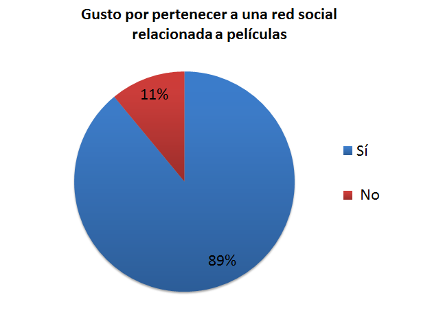

**¿De qué manera vizualiza películas?**

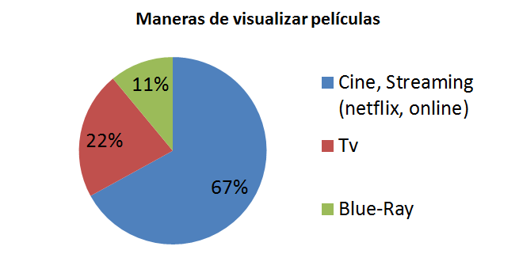

**¿Que generó de películas le gustan más?**

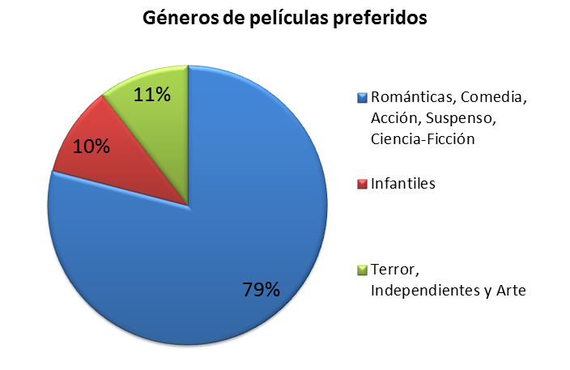

**¿Que es más importante para usted al elegir una película?**

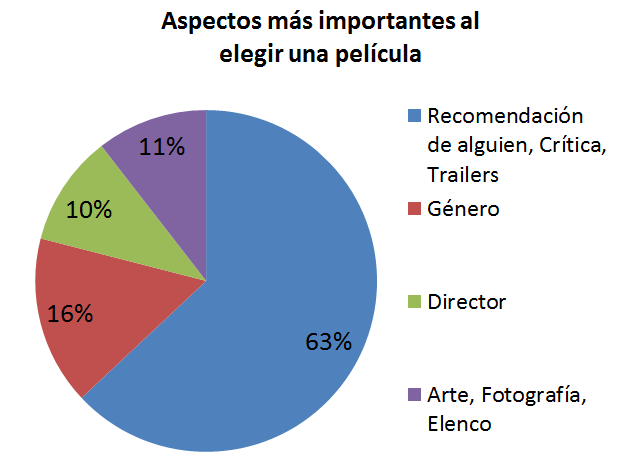

**¿Te gustaría formar parte de una comunidad  donde se comprartan gustos por películas,críticas y recomendaciones?**

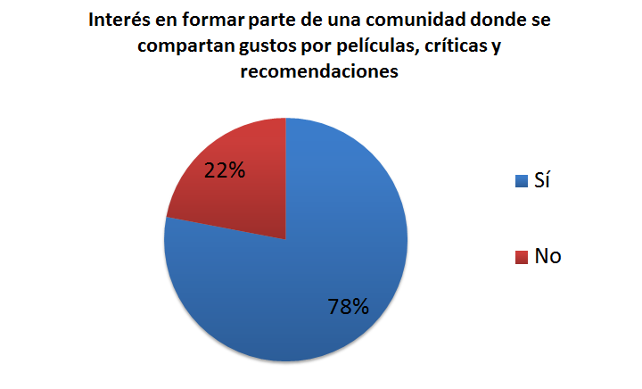

**¿Actualmente en sus redes sociales sigue páginas relacionadas con películas ?**

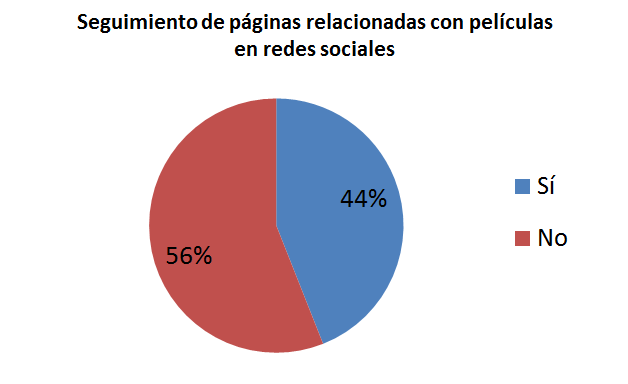

**¿Qué le gustaría encontrar en una red social con tema de películas?**

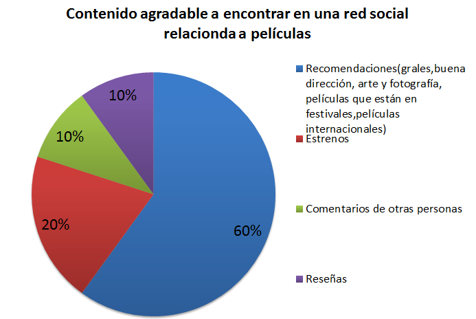

** Delimitando el problema  y lluvia de ideas**

Por medio de una lluvia de ideas y después de analizar la documentación, nuestro team conformado por Liz , Jessy y Henie ha decidido realizar una red social con tema de películas, buscando cumplir con los requerimientos planteados en los puntos anteriores.

## DEFINICIÓN

** Hipótesis **

Creando una red social con tema de películas se puede unir una comunidad con intereses similares que compartan información, comentarios y reseñas.

** Propuesta de valor **

En un primer alcance nuestra red social no solo unirá personas con intereses relacionados a películas sino que también les dará la oportunidad de acceder a reseñas tanto de profesionales en el medio como de amigos y conocidos ; posteriormente se implementará un apartado desde el cual se enlace con los cinemas locales, se puedan reservar y adquirir boletos para todas las películas en cartelera, de igual manera para las premiere de las mejores películas.

** Objetivo **

Crear una red en la que se puedan crear Perfiles de usuarios y estos
puedan ver las actualizaciones de todos tus contactos mediante un newsfeed,
se incluirá un apartado para escribir posts y subir fotos.
_Toda version debe ser mobile friendly._

## PROTOTIPADO
***
 ### Historia de usuario
 ***
 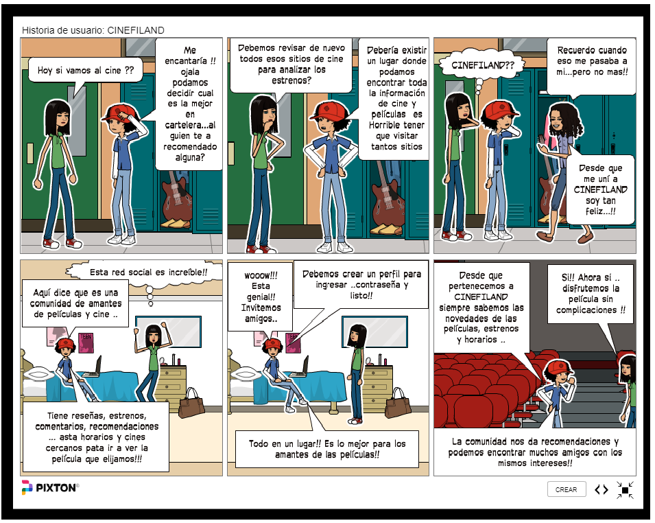

 >https://Pixton.com/mx/:0ltm6i9m

***
** Mock-up **

_Log in_

_Inicio_

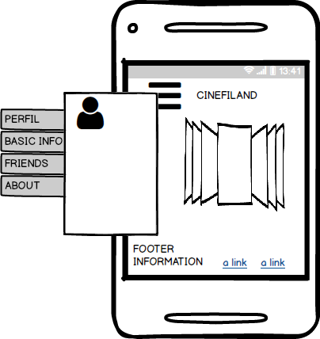

_Web_

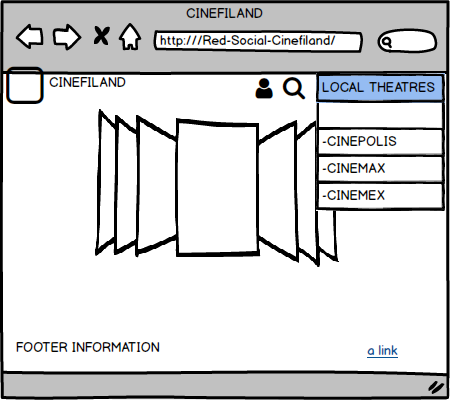

## FIREBASE

**Login: lizbeth_perez_v@hotmail.com**

**Contraseña: maria23091**
